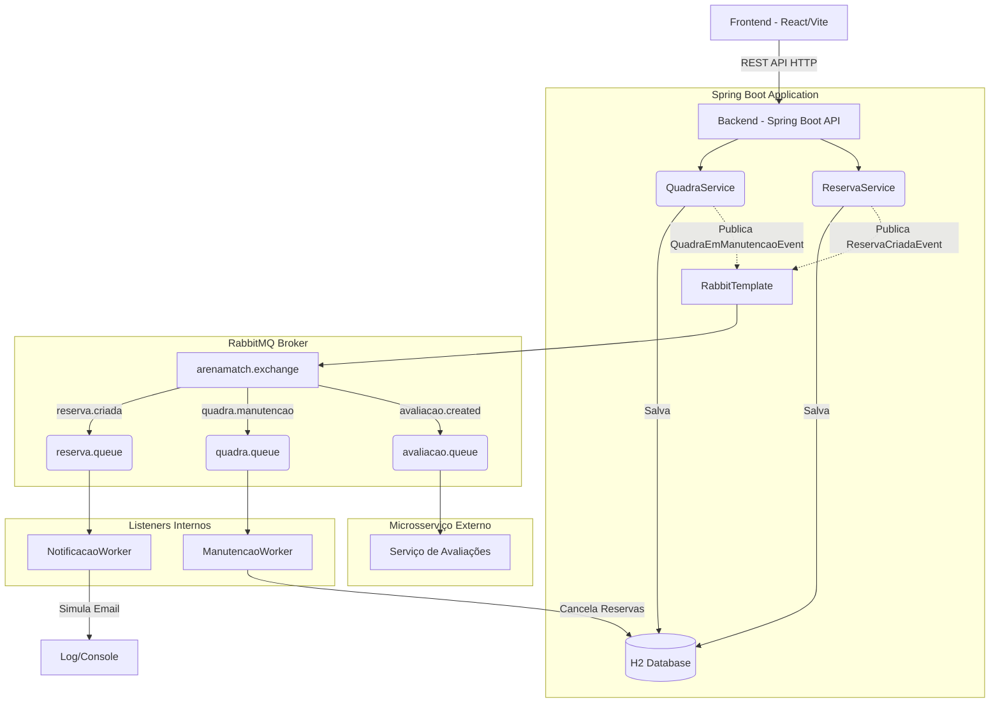
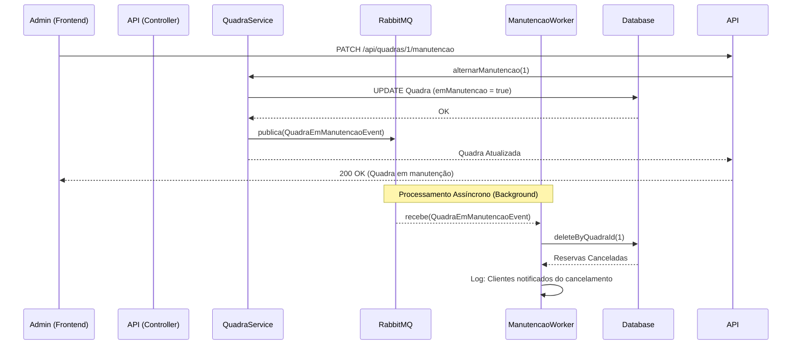

# Documentação da Arquitetura Orientada a Eventos - ArenaMatch (TP4)

Este documento descreve a refatoração realizada no sistema ArenaMatch para a transição de uma arquitetura síncrona (acoplada) para uma **Arquitetura Orientada a Eventos (Event-Driven Architecture - EDA)** utilizando o RabbitMQ como message broker.

---

## 1. Avaliação da Arquitetura Orientada a Eventos

A adoção da EDA trouxe mudanças significativas no comportamento do sistema. Abaixo estão os prós e contras observados:

### Prós (Vantagens)
*   **Desacoplamento:** Os serviços não precisam mais "conhecer" uns aos outros. O `ReservaService` e o `QuadraService` operam independentemente dos workers que processam suas consequências.
*   **Resiliência e Tolerância a Falhas:** Se o serviço de envio de e-mail (simulado pelo `NotificacaoWorker`) ou o serviço de avaliações ficar offline, a API principal continua funcionando normalmente. As mensagens ficam retidas na fila do RabbitMQ até que o consumidor volte à vida.
*   **Escalabilidade Assíncrona:** A resposta ao usuário (Frontend) é imediata (ex: recebendo `202 Accepted`). O processamento pesado (envio de e-mails, cancelamento em massa) ocorre em background sem travar o cliente.

### Contras (Desafios)
*   **Complexidade Inerente:** Rastrear um erro em um sistema assíncrono é mais difícil. O fluxo não é mais linear e contínuo (uma chamada não retorna o erro imediatamente para o frontend).
*   **Consistência Eventual:** A exclusão das reservas quando uma quadra entra em manutenção não acontece exatamente no mesmo milissegundo. Existe um _delay_ (atraso) aceitável até que as filas sejam processadas.
*   **Necessidade de Infraestrutura Adicional:** É obrigatório manter um broker ativo (RabbitMQ) para que o sistema funcione.

**Cenário ideal para EDA:** Sistemas com alto volume de escritas, regras de negócio encadeadas (um evento dispara diversas consequências, como enviar e-mail + cancelar faturas + notificar admin) e integrações com sistemas externos instáveis.

---

## 2. Padrões de Mensagens Utilizados

Para atender os diversos casos de uso, utilizamos o padrão **Publish-Subscribe (Pub/Sub)** e **Work Queues** viabilizado por uma `DirectExchange` (`arenamatch.exchange`) no RabbitMQ.

Criamos três domínios de eventos (Routing Keys e Filas):
1.  **Integração Externa (Avaliações):**
    *   **Fila:** `avaliacao.queue` | **Routing Key:** `avaliacao.created`
    *   **Uso:** Disparada pelo Controller para que um sistema secundário (Microsserviço de Avaliação) processe a nota de uma quadra, substituindo o acoplamento temporal que havia com o OpenFeign.
2.  **Notificação (Reservas):**
    *   **Fila:** `reserva.queue` | **Routing Key:** `reserva.criada`
    *   **Uso:** Quando uma reserva é inserida no banco de dados com sucesso, o evento `ReservaCriadaEvent` é despachado. Consumido pelo `NotificacaoWorker` para simulação de envio de e-mail de confirmação.
3.  **Core de Negócios (Manutenção):**
    *   **Fila:** `quadra.queue` | **Routing Key:** `quadra.manutencao`
    *   **Uso:** Ao alternar uma quadra para o status `Em Manutenção`, o evento `QuadraEmManutencaoEvent` é disparado. Consumido pelo `ManutencaoWorker`, que de forma autônoma acessa o banco e deleta/cancela todas as reservas atreladas àquela quadra.

---

## 3. Implementação com Spring Boot e RabbitMQ

As abstrações do ecossistema `spring-boot-starter-amqp` simplificaram radicalmente o código:
*   **`RabbitMQConfig.java`**: Centraliza a definição estrutural (Exchange, Queues, Bindings) e implementa o `Jackson2JsonMessageConverter`, garantindo que os objetos (DTOs/Eventos) transitem na rede como JSON de forma transparente.
*   **`RabbitTemplate`**: Injetado nos Services, substituiu as requisições HTTP e facilitou o disparo assíncrono através do método `convertAndSend`.
*   **`@RabbitListener`**: Utilizado nos Workers, transforma métodos Java comuns em ouvintes (consumidores) de filas específicos, rodando em background continuamente.

---

## 4. Diagramas de Arquitetura e Fluxo de Eventos

### 4.1. Diagrama de Arquitetura (Visão Geral)

### 4.2. Fluxo: Colocando Quadra em Manutenção

O diagrama abaixo ilustra o comportamento reativo do sistema. O usuário apenas solicita a manutenção, recebe o "OK" imediato, enquanto a exclusão em cascata das reservas afetadas ocorre em segundo plano através da fila de mensagens.

