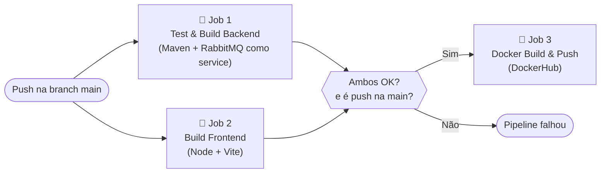

# Documentação do TP5 - Implantação e Manutenção em Produção

Este documento detalha as estratégias de conteinerização, orquestração, monitoramento, CI/CD e testes implementados para levar o sistema ArenaMatch a um ambiente de produção.

---

## 1. Estrutura de Arquivos Criados

```
projetoArenaMatch/
├── .github/
│   └── workflows/
│       └── ci-cd.yml              # Pipeline de CI/CD GitHub Actions
├── k8s/
│   ├── rabbitmq.yaml              # Manifesto Kubernetes - RabbitMQ
│   ├── backend.yaml               # Manifesto Kubernetes - Backend + HPA
│   └── frontend.yaml              # Manifesto Kubernetes - Frontend
├── docker-compose.yml             # Orquestração local completa
├── backArenaMatch/
│   ├── Dockerfile                 # Build multi-stage do backend
│   └── src/test/
│       ├── quadras/QuadraServiceTest.java   # Testes unitários
│       └── reservas/ReservaServiceTest.java # Testes unitários
└── frontArenaMatch/
    └── Dockerfile                 # Build multi-stage do frontend
```

---

## 2. Conteinerização com Docker

### 2.1. Estratégia Multi-Stage Build

Ambos os serviços utilizam **Dockerfile multi-stage** para garantir imagens leves e seguras em produção:

**Backend ([`backArenaMatch/Dockerfile`](backArenaMatch/Dockerfile)):**
- **Stage 1 (builder):** Usa `maven:3.9.9-eclipse-temurin-21` para compilar e empacotar o JAR.
- **Stage 2 (runtime):** Usa `eclipse-temurin:21-jre-alpine` (imagem mínima, ~200MB menor) para rodar apenas o JAR compilado. Inclui usuário não-root por segurança.

**Frontend ([`frontArenaMatch/Dockerfile`](frontArenaMatch/Dockerfile)):**
- **Stage 1 (builder):** Usa `node:22-alpine` para instalar dependências e fazer o build React.
- **Stage 2 (runtime):** Usa `nginx:alpine` para servir os arquivos estáticos gerados em `/dist`.

### 2.2. Docker Compose (Ambiente Completo Local)

O arquivo [`docker-compose.yml`](docker-compose.yml) sobe todos os 3 serviços com uma única linha de comando:

```bash
docker compose up --build
```

| Serviço    | Imagem                    | Porta | Descrição                              |
|------------|---------------------------|-------|----------------------------------------|
| rabbitmq   | rabbitmq:3-management     | 5672, 15672 | Message Broker + Painel Web     |
| backend    | (build local)             | 8080  | API Spring Boot                        |
| frontend   | (build local)             | 80    | React + Nginx                          |

**Healthchecks:** O `backend` só sobe após o `rabbitmq` estar saudável, e o `frontend` só sobe após o `backend` passar no healthcheck no `/actuator/health`.

---

## 3. Orquestração com Kubernetes

Os manifestos em `k8s/` permitem implantar o sistema em qualquer cluster Kubernetes (Minikube, AKS, GKE, etc.):

```bash
# Aplicar todos os manifestos
kubectl apply -f k8s/
```

### Recursos Criados

```mermaid
graph TD
    subgraph Kubernetes Cluster
        subgraph Serviços
            SVC_BE[Service: arenamatch-backend\ntype: LoadBalancer\nport: 8080]
            SVC_FE[Service: arenamatch-frontend\ntype: LoadBalancer\nport: 80]
            SVC_RMQ[Service: rabbitmq\nport: 5672 / 15672]
        end

        subgraph Deployments
            DEP_BE[Deployment: arenamatch-backend\nreplicas: 2\nimage: machadocalebe/arenamatch-backend]
            DEP_FE[Deployment: arenamatch-frontend\nreplicas: 1]
            DEP_RMQ[Deployment: rabbitmq\nreplicas: 1]
            HPA[HorizontalPodAutoscaler\nmin: 2 | max: 5\ncpu target: 70%]
        end
    end

    HPA -.->|escala automaticamente| DEP_BE
    SVC_BE --> DEP_BE
    SVC_FE --> DEP_FE
    SVC_RMQ --> DEP_RMQ
```

**Destaques:**
- O backend roda com **2 réplicas** por padrão para alta disponibilidade.
- O **HorizontalPodAutoscaler (HPA)** escala o backend automaticamente até 5 réplicas quando o CPU ultrapassar 70%.
- Os pods incluem `readinessProbe` e `livenessProbe` via `/actuator/health`.

---

## 4. Monitoramento com Spring Actuator

O **Spring Boot Actuator** foi habilitado no `application.properties`, expondo os seguintes endpoints:

| Endpoint                         | Descrição                                        |
|----------------------------------|--------------------------------------------------|
| `GET /actuator/health`           | Status geral da aplicação (DB, RabbitMQ, Disco) |
| `GET /actuator/health/rabbitmq`  | Status específico da conexão com o RabbitMQ     |
| `GET /actuator/info`             | Metadados da aplicação                          |

Exemplo de resposta ao chamar `http://localhost:8080/actuator/health`:
```json
{
  "status": "UP",
  "components": {
    "db": { "status": "UP" },
    "rabbit": { "status": "UP", "details": { "version": "3.x.x" } },
    "diskSpace": { "status": "UP" }
  }
}
```

---

## 5. Automação com GitHub Actions (CI/CD)

O arquivo [`.github/workflows/ci-cd.yml`](.github/workflows/ci-cd.yml) define um pipeline de 3 jobs que roda automaticamente a cada `push` ou `pull_request` na branch `main`:



### Configuração de Secrets

Para o Job 3 funcionar, adicione no seu repositório GitHub (Settings → Secrets → Actions):

| Secret                 | Valor                           |
|------------------------|---------------------------------|
| `DOCKERHUB_USERNAME`   | Seu usuário do Docker Hub       |
| `DOCKERHUB_TOKEN`      | Token de acesso do Docker Hub   |

---

## 6. Testes Abrangentes

Além dos testes de repositório já existentes (TP3), foram criados **testes unitários dos Services** usando o padrão **Mockito + JUnit 5**:

### Testes Criados

| Arquivo                  | Testes | Cobertura                                                              |
|--------------------------|--------|------------------------------------------------------------------------|
| `QuadraServiceTest.java` | 4      | Criar quadra, listar, exceção 404, publicação de evento no RabbitMQ   |
| `ReservaServiceTest.java`| 4      | Criar reserva + evento, quadra em manutenção, conflito de horário, deletar |

**Estratégia:** Como os Services são unidades de lógica de negócio e dependem do `RabbitTemplate` e dos Repositories, o **Mockito** substitui essas dependências por mocks controlados, permitindo testar somente a lógica do Service em isolamento.

Para rodar todos os testes:
```bash
cd backArenaMatch
./mvnw test
```

---

## 7. Guia de Implantação Completo

### Ambiente Local (Docker Compose)
```bash
# 1. Certifique-se que o Docker Desktop está rodando
# 2. Na raiz do projeto:
docker compose up --build

# Frontend:  http://localhost
# Backend:   http://localhost:8080
# RabbitMQ:  http://localhost:15672 (guest/guest)
# Actuator:  http://localhost:8080/actuator/health
```

### Kubernetes (Minikube)
```bash
# 1. Iniciar o Minikube
minikube start

# 2. Aplicar todos os manifestos
kubectl apply -f k8s/

# 3. Verificar os pods
kubectl get pods

# 4. Acessar a aplicação
minikube service arenamatch-backend
```
